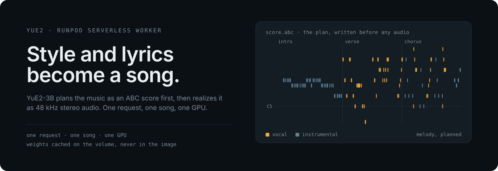

<p align="center">
  
</p>

<p align="center">
  <code>POST a style + lyrics</code> → <code>get back a song</code>
</p>

---

A RunPod Serverless worker that turns a style prompt and lyrics into a complete
song — vocals and accompaniment, 48 kHz stereo — on a single 24 GB GPU. Built on
[YuE2-3B](https://huggingface.co/m-a-p/YuE2-3B), which plans the music as an ABC
score first and then realizes it as audio.

Three modes, one endpoint: **create** a song from a prompt, **cover** an existing
recording in a new style, or **edit** a score and re-render it. Nothing for you to
run.

All three are **verified end to end on hardware** — see [Current scope](#current-scope).

## What you send, what you get

```jsonc
// POST https://api.runpod.ai/v2/<endpoint>/run
{
  "input": {
    "mode":   "create",   // "create" | "cover" | "edit"  — default "create"
    "style":  "City Pop, upbeat, groovy bass, electric guitar, neon city night",
    "lyrics": "[Verse]\nStreetlights blink, watching every passer-by\n[Chorus]\nTonight we stay awake",
    "cot":    "full",     // "full" | "melody" | "off"   — default "full"
    "seed":   12300       // optional, default 831001
  }
}
```

```jsonc
// response
{
  "mode":          "create",
  "audio_url":     "https://…/audio.flac",  // presigned, 7-day expiry
  "score_abc_url": "https://…/score.abc",   // the plan the model wrote first
  "duration":      214.85,                  // seconds of audio
  "sample_rate":   48000,
  "elapsed_seconds": 34.88,                 // generation only, excl. upload
  "seed":          12300,
  "cot":           "full",
  "decoder":       "m-a-p/YuE2-Vae",
  "truncated":     false,                   // true if a stage hit its token cap
  "truncation_by_stage": { "abc": false, "semantic": false },
  "request":       { … },                   // what was asked, echoed back
  "timings":       { "abc": {…}, "semantic": {…}, "nar_seconds": … },
  "artifact_urls": { … },                   // every artifact, incl. result.json
  "vram":          { … }                    // see "VRAM reporting" below
}
```

`cover` and `edit` add **`stages`**, describing what the mode did before
generating:

```jsonc
// cover
"stages": { "sheetsage": { "ok": true, "seconds": 22.4 },
            "asr":       { "ok": true, "seconds": 78.4, "used": true, "reason": "transcribed" } }

// edit
"stages": { "score": { "source": "supplied" } }   // or "plan" when no abc was sent
```

The response carries **URLs and metadata, never audio bytes**. A full song does
not belong in a job response, and polling stays cheap.

### Fields

| Field | Required | Notes |
|---|---|---|
| `mode` | no | Defaults to `create`. An unrecognised value is rejected. |
| `style` | **yes** | Genre, instruments, vocal character, language, tempo. |
| `lyrics` | *per mode* | Required for `create` and `edit`. Optional for `cover` (transcribed). Omit entirely when `instrumental` is true. |
| `cot` | no | `full` plans melody + chords; `melody` is melody-only; `off` skips planning. Default `full`. |
| `seed` | no | Integer. Default 831001. |
| `cfg_scale` | no | Classifier-free guidance scale. |
| `abc` | no | An external ABC score. **Requires `cot="full"` or `cot="melody"`** — a score needs a plan to hang off, and `cot="off"` has none. |
| `instrumental` | no | Boolean. Requests no vocals — see below. |
| `source_audio` | `cover` only | **Yes for `cover`.** An `https://` URL or a base64 `data:` payload. |
| `id` | no | Artifact path component. Defaults to `"song"`. |

Anything unrecognised is ignored; anything malformed returns `{"error": …}`.

### Instrumental requests

YuE2 has no instrumental mode — `lyrics` is a required field upstream and the
prompt always carries a `[Lyrics]` section. So `"instrumental": true` fills that
slot with a wordless `[instrumental]` section tag.

```jsonc
{ "input": { "mode": "create", "style": "ambient piano, no vocals", "instrumental": true } }
```

- Sending `instrumental: true` **with** non-empty `lyrics` is **refused**, not
  interpreted — one of the two is a mistake. An empty string counts as absent.
- The value must be a real boolean. The string `"false"` is rejected, because
  `bool("false")` is `True`.
- **Whether the audio is actually instrumental is unverified.** It cannot be
  checked without a GPU and nobody has listened yet. Treat the flag as a defined
  *input*, not a guarantee about the output.

## The three modes

| `mode` | You send | It does |
|---|---|---|
| `create` | style + lyrics | generates a song |
| `cover` | a recording + a target style | transcribes the melody and lyrics, then generates a cover |
| `edit` | style + lyrics, optionally a revised `abc` | re-renders from the supplied score, or from a plan it writes |

```jsonc
// cover — the recording supplies the melody; ASR supplies the words
{
  "input": {
    "mode":         "cover",
    "source_audio": "https://…/original.mp3",
    "style":        "Jazz-funk, Rhodes piano, brushed drums",
    "lyrics":       "…"          // optional: omit and Qwen3-ASR transcribes them
  }
}
```

```jsonc
// edit — hand back a score you revised, keeping its harmony
{
  "input": {
    "mode":   "edit",
    "abc":    "X:1\nT:…\nK:Bb\n…",   // omit to edit a plan the model writes
    "style":  "stripped-back piano, slower",
    "lyrics": "…"
  }
}
```

A cover's melody is transcribed to a **melody-only** ABC score and verified free
of chord symbols before generation, because YuE2's `cot="melody"` does not strip
chords itself. An edit keeps the supplied harmony — that is what `cot="full"`
means there. **Editing re-renders the whole song**; the waveform outside the
edited region is not preserved.

### Artifacts

Every job uploads its working directory. `create` produces ~11 files; `cover` and
`edit` produce more, because the transcription stages keep their own:

```
audio.flac  score.abc  plan.json  latent.npy  semantic.npy  abc_tokens.npy
prefix.npy  config.json  request.json  result.json  plan_manifest.json
sheetsage/…   asr/…        ← cover only: the raw transcription and its metadata
```

`artifact_urls` is keyed by relative path, so `sheetsage/score.abc` (raw
transcription) and `score.abc` (the song's own score) are distinct keys.

### VRAM reporting

Every response — including failures — carries a device-wide VRAM sample taken
across the job:

```jsonc
"vram": {
  "available": true,
  "device_name": "NVIDIA L4",     // the pool is mixed; a peak without its card means little
  "mig_mode": "[N/A]",
  "device_total_mib": 23034,
  "baseline_mib": 277,             // an idle container still holds a CUDA context
  "peak_mib": 9270,
  "per_phase": { "job": 750, "transcribe": 4446, "generate": 9270, "upload": 720 },
  "samples": 543
}
```

`per_phase` is the interesting part: a cover peaks at its `generate` figure, not
at `transcribe + generate`, because each transcription runs as its own subprocess
and releases its VRAM before generation starts. `peak_mib` is a **lower bound** —
it is sampled, not instrumented, so a spike entirely between two samples is
missed.

## Errors

Validation, boot, generation and upload all return a structured error rather than
raising:

```jsonc
{ "error": "…" }                            // human-readable, safe to show or log
{ "error": "…", "vram": { … } }             // failures after sampling began
```

Two kinds are worth distinguishing in a UI:

- **`"Worker unavailable: …"`** — the worker booted but cannot serve (a missing
  model, a bad cache). Every job on that worker returns this. It is not the
  request's fault and retrying will not help.
- **Anything else** — a problem with *this* job: a bad field, a bad URL, a
  generation failure.

A job rejected for bad input fails in **under a second** with no GPU time,
because validation and storage resolution both run before generation.

## How it works

```
  POST /run
      │
      ├─ validate ──────── against the pipeline's own bounds, before any GPU work
      ├─ resolve storage ─ a bad bucket fails here, not after a long generation
      │
      ├─ [cover] SheetsSage2 → melody.abc    ┐ each runs as its own subprocess,
      ├─ [cover] Qwen3-ASR   → lyrics.txt    ┘ then exits
      │
      ├─ generate
      │    ├─ plan   → score.abc      the model writes the music as notation first
      │    ├─ semantic → tokens
      │    ├─ NAR    → latents
      │    └─ decode → audio.flac     YuE2-Vae, 48 kHz stereo
      │
      ├─ upload → B2                  presigned URLs minted locally, no round trip
      └─ respond → URLs + metadata
```

**Weights live on a network volume, never in the image.** The worker caches five
HuggingFace repos into the volume on first boot and enables offline mode once it
has verified the cache, so a missing file fails loudly instead of quietly
re-downloading.

## Layout

```
Dockerfile                 at the repo root — RunPod's default build path
worker/
├── handler.py             RunPod entrypoint; boots at import, generates per job
├── boot.py                model cache resolution + fallback, pipeline construction
├── schema.py              job validation, mirroring the pipeline's own bounds
├── storage.py             Backblaze B2 egress over the S3 API
├── config.py              environment-driven settings
├── modes.py               create | cover | edit dispatch
├── abc_score.py           ABC validation and chord stripping
├── subprocess_runner.py   runs one model family as its own subprocess
├── vram.py                device-wide memory sampling, per job
├── check_env.py           asserts each environment matches its pins
├── transcribe_sheetsage/  audio → melody.abc   (subprocess entrypoint)
├── transcribe_asr/        audio → lyrics.txt   (subprocess entrypoint)
├── requirements.txt       exact pins — never a loose range
└── .runpod/               endpoint config and example job payloads
tests/                     GPU and B2 both mocked — runs with no hardware
```

## Running it

The test suite needs **no GPU, no network and no credentials** — the GPU and B2
are both mocked, by design:

```bash
python -m pytest tests/ -q
```

The image is built by **RunPod's platform** from this repository, not locally.
Push, then watch the endpoint's **Builds** tab. Nothing is built or installed on
a dev box.

### Deploying

1. Import this repo as a Serverless endpoint. The Dockerfile is at the root, so
   no build-path configuration is needed.
2. Attach a network volume at `/runpod-volume`.
3. Set the four storage variables on the endpoint template:

   ```
   B2_ENDPOINT_URL   B2_KEY_ID   B2_APP_KEY   B2_BUCKET
   ```

   Credentials belong on the endpoint, never in the image — a key in a
   Dockerfile persists in the layers forever.

**Cached models are optional and limited to one.** RunPod's cached-models feature
holds a single HuggingFace repo; the worker caches five:

| Repo | Needed by | Size |
|---|---|---|
| `m-a-p/YuE2-3B` | all modes | 7.3 GB |
| `m-a-p/YuE2-Vae` | all modes | 0.5 GB |
| `m-a-p/SheetSage2` | `cover`, `edit` | 0.2 GB |
| `m-a-p/MERT-v2-FullSong` | `cover` — SheetSage2's encoder parent | 2.5 GB |
| `Qwen/Qwen3-ASR-1.7B` | `cover` | 4.7 GB |

Pointing the cached-model slot at `m-a-p/YuE2-3B` (the largest) and letting the
worker download the rest into the volume is the intended arrangement. Those ~8 GB
are fetched **once**, during boot, before any job's timeout starts. A fresh volume
pays it on the first cold start; subsequent starts are cache hits.

Optional environment variables: `VOLUME_ROOT`, `MEMORY_BUDGET_GIB`,
`JOB_TIMEOUT_SECONDS`, `YUE2_VAE_REPO`, `YUE2_PROGRESS`, `DEFAULT_COT`,
`LOG_LEVEL`, `HF_LOCAL_FILES_ONLY`, `VRAM_SAMPLE_INTERVAL_SECONDS`. See
[`worker/.env.example`](worker/.env.example).

| Endpoint setting | Value | Why |
|---|---|---|
| GPU | any 24 GB card, ×1 | measured peaks 8.3–9.1 GiB; one song at a time |
| Container disk | 30 GB | the image was 10.8 GB with two torch stacks; the venv collapse removes ~6.5 GB of that, so 20 GB is ample |
| Job timeout | ≥ 30 min | generation plus model load, with headroom |
| Network volume | `/runpod-volume` | datacenter-specific — endpoint and volume must share a DC |

The GPU list may name several 24 GB types; the worker runs on whichever the pool
provides. **Quote the card with any peak you record** — the pool is not
homogeneous and reported totals differ between cards.

## Design notes

**Validation happens before the GPU does.** `schema.py` mirrors the pipeline's own
limits on purpose. The pipeline validates too, but only once the model is
resident — so a mistyped seed costs a full generation's worth of GPU time instead
of a millisecond.

**Failures return structured errors.** A worker that dies on one bad job is a
worker that keeps costing money.

**The pipeline boots before the first job**, not lazily. A lazy first load would
put the weight download inside a job's own timeout.

**One environment, separate processes.** SheetSage2 and Qwen3-ASR were originally
given their own virtual environments, on the assumption their pins could not
coexist with YuE2's torch 2.10.0 / numpy 2.2.6. That assumption was tested and was
wrong: both run correctly on the main stack — verified on hardware, including a
SheetSage2 transcription of 168 notes with the chord symbols correctly absent. The
venvs were removed, and the image is ~6.5 GB smaller for it.

**What remains is the process boundary, and that is the part that matters.** Each
model family still runs as its own subprocess, which returns its VRAM to the
driver on exit — that is why a cover costs no more VRAM than a create, and it is
independent of whether the interpreter is shared.

**Importing `handler` has side effects** — it boots the model and starts the SDK.
Anything inspecting the code uses `python -m py_compile`, never `import`.

## Current scope

All three modes are **verified end to end on real hardware**:

| Mode | Result | Peak VRAM | Song |
|---|---|---|---|
| `create` | ✅ | 9072 MiB | 197 s |
| `cover` | ✅ | 9270 MiB | 199 s |
| `edit` | ✅ | 9348 MiB | 199 s |

A cover runs two extra model families and peaks **no higher than a create of the
same song** — the subprocess boundary holds, with ~13 GB left on a 24 GB card.

Not yet verified, and worth knowing before you rely on them:

- **`instrumental: true`** — the input is defined and validated; whether the audio
  comes back without vocals has not been listened to.
- **Numerical quality of a cover.** The transcription is confirmed sane (ASR
  recovers the input lyrics from a generated song), but nobody has judged whether
  a cover *sounds* like a good cover.

## Licensing

The **YuE2-3B weights are CC BY-NC 4.0** with an additional creator permission:
individuals and creators may use and monetize outputs royalty-free, academic
non-commercial use is free, and **commercial use by companies requires contacting
the YuE2 authors**. The code in this repository is Apache 2.0. SheetSage2,
MERT-v2-FullSong and Qwen3-ASR weights, needed for cover mode, carry their own
terms — confirm separately before any commercial use.
